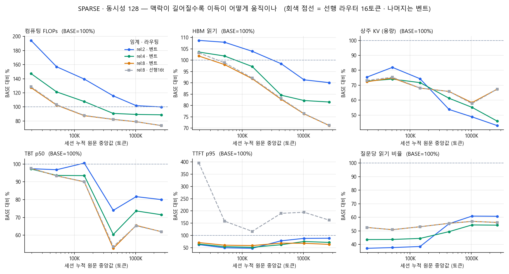
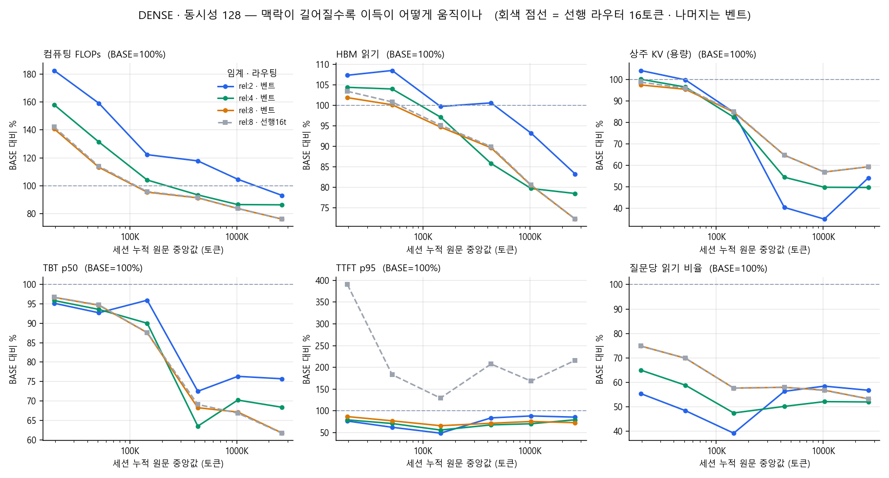

# 캐시 라우팅 — 자연어로 다시 써서 나누고, 질문마다 필요한 것만 읽는다

> 🔬 **진행 중** — 라우팅 비용(첫 응답 지연)을 줄이기 위해 **벤트 분배 방식**을 테스트하고 있다.
> 세부 파일 이름을 답변 전에 뱉는 대신, 메인 본문의 표시에 주소를 붙여 **답변 도중에** 열도록 하는 방식이다.

> ### ▶ **[웹으로 보기 — rhydcdc.github.io/Cache_Routing](https://rhydcdc.github.io/Cache_Routing/)**
>
> **이 문서보다 그쪽을 먼저 보길 권한다.** 같은 내용에 **아키텍처 실제 연출**이 얹혀 있다 —
> 문서 넷의 **메인 캐시 전문과 세부 캐시 81개가 실물로** 들어 있고, 질문을 누르면
> 그 회차의 라우터가 **어느 세부를 왜 골랐는지, 그때 실제로 몇 토큰을 읽었는지** 그대로 재생된다.
> (저장소의 `index.html` 은 GitHub 에서 소스로만 보인다. 위 주소로 열어야 한다.)

---

## 1. 아이디어

기존 캐시 압축은 **숫자를 줄인다** — 저랭크 분해, 양자화, 토큰 축출. 전부 KV 행렬 안의 수치를 건드린다.

> **우리는 캐시가 나르던 *내용*을 자연어로 다시 쓴 뒤, 그것을 다시 프리필해 새 캐시를 만들고 원래 캐시를 버린다.**

압축이 텐서 연산이 아니라 **재작성**으로 일어난다. 그래서 산출물은 모델이 아니라 **규약(프롬프트)** 이다.

| 무엇을 보나 | 기존 캐시 압축 | **캐시 라우팅** |
|---|---|---|
| **층위** | **숫자의 잉여** — 행이 겹치거나, 랭크가 낮거나, 비트가 과함 | **정보의 잉여** — 같은 사실이 여러 번 진술됨 |
| 무엇을 줄이나 | KV 행렬의 **수치** | 캐시가 나르는 **내용** |
| 연산 | 축출 · 병합 · 저랭크 · 양자화 | **자연어로 다시 쓰기 → 재프리필** |
| 캐시를 무엇으로 보나 | 텐서 | 자연어로 환원 가능한 내용 |
| 산출물 | 알고리즘 | **규약(프롬프트)** |

두 층위는 서로 다르다.
**그래서 기존 축출과 곱해질 수 있다.**

> ### 추측 — 왜 겹치지 않을 것 같은가
>
> **검증하지 않았다. 가설이다.**
>
> 기존 축출은 **미래에 어떤 질문이 올지 모르는 상태에서**, 자연어의 의미와는 괴리된
> **어텐션 매스나 위치 규칙**으로 버릴 것을 고른다. 그리고 그 평가에 **정답 회수 과제가 없었다.**
> 그렇다면 그것이 버리는 것과 우리가 지우는 정보의 잉여는 **서로 다른 축**에 있다.
>
> (질문이 프롬프트에 이미 들어 있는 계열은 질문을 알고 고르므로 여기서 말하는 대상이 아니다.)

### 무엇을 버려도 되는가 — 근거 셋

| 근거 | 뜻 | 처분 |
|---|---|---|
| **중복 진술** | 같은 내용이 여러 번 진술됨 | **하나로 정리해 남김** |
| **추론 가능** | 원본이 없어도 주변 문맥에서 복원됨 | 버림 (복원 원본이 출력에 남아 있을 때만) |
| **파라메트릭** | 모델 가중치가 이미 앎 | 버림 — **단 내용만. 주소는 남긴다** |

> ⚠️ **파라메트릭은 이번 프로젝트에서 적용하지 않는다.**
> *"모델이 이미 안다"* 는 짐작하면 틀리고, 틀리면 정보가 사라져 되찾을 수 없다.
> 판정 기준은 하나뿐이다 — **참조 없이 소비 모델이 그 정보를 출력할 수 있는가.**
> 그건 재는 것이지 추정하는 것이 아니라서, 프로브가 확인해 준 경우에만 켠다. **기본은 꺼져 있다.**

---

## 2. 기여 둘

### ① 리프리필 — 원본 캐시를 버리고 새로 만든다

자연어를 경유하는 게 우회로 보이지만, **캐시를 *만드는* 행위는 기존에 없었다.**
캐시는 언제나 토큰열을 통과시킨 *결과*였다. 정제된 캐시를 얻으려면 그것을 출력시킬 입력이 필요하고,
**그 입력이 자연어다.** 자연어는 우회가 아니라 유일한 경로다.

> ### 그래서 위치 정렬(RoPE) 문제가 없다
> 미리 계산한 KV 블록은 **만들어진 위치에 묶인다.** 그래서 옮겨 붙이려면 정렬이 필요하다.
> **텍스트는 위치가 없다.** 붙이는 그 자리에서 프리필하므로 **옮겨 붙일 것이 애초에 없다.**
> 다시 캐시를 생성하는 구조라서 공짜로 얻어지는 장점이다.

### ② 메인 캐시 / 세부 캐시 분리

정제본을 다시 **메인**과 **세부**로 나눈다.

| 층 | 무엇이 들어가나 | 언제 읽나 |
|---|---|---|
| **메인 캐시** | 흐름과 맥락, 그리고 **무엇이 어디 있는지** | **항상** · 상주 |
| **세부 캐시** | 그 흐름의 **잎(leaf)** — 값 | 그 질문에 필요할 때만 |

> **"포인터"는 이 구조의 이름이지 별도의 층이 아니다.** 인덱스 파일도 라우팅 모듈도 없다.
> 메인 본문이 *무엇이 어디 있는지* 를 자연어로 말하고, 소비 모델이 **읽고 판단해** 세부를 가져온다.
> **검색기·임베딩·인덱스가 한 단계도 안 끼어든다.**

---

## 3. 자연어 층이 하는 일 — 두 개의 인터페이스

| # | 무엇 사이를 잇나 | 왜 공짜인가 |
|---|---|---|
| **①** | **모델과 모델** — 정제하는 모델 ↔ 소비하는 모델 | 이음매가 텐서가 아니라 **문자열**이다. 베이스 모델이 자기 vocab 으로 재토크나이즈해 프리필하는 순간 정제 모델의 토크나이저는 사라진다. ∴ **토크나이저·차원·아키텍처·벤더가 달라도 된다** |
| **②** | **메인 캐시와 세부 캐시** | 라우팅이 **자연어 문장을 읽고 판단**하는 것이라 별도 임베딩 공간이 필요 없다. 가져온 것이 문서인지 캐시인지 모델에게 보이지 않는다 — 인터페이스가 같은 자연어이기 때문이다 |

∴ 이 구조는 소비 모델에게 **새로운 능력을 요구하지 않는다.** 지금 필요한 문서를 찾아 읽는 행위와 같고,
그 층위만 문서에서 캐시로 옮겨 간 것이다.

**저장은 자연어, 상주는 KV.** 자연어는 저장·인터페이스 형태이고 KV 는 상주 형태다.
사람이 읽을 수 있고 모델이 바뀌어도 그대로 쓰인다.

---

## 4. 무엇과 다른가 — MoE · RAG

셋 다 골격이 같다 — **가진 것은 많되 한 번에 쓰는 것은 일부.** 총량 ≫ 활성량.
우리 결과표에서 `분배 전체(저장)` 와 `질문 시점 유효` 두 행의 **간격이 곧 그 몫**이다.

**갈리는 곳은 라우터다.**

| | MoE | RAG | **캐시 라우팅** |
|---|---|---|---|
| **무엇을 아껴 쓰나** | 가중치 (모델) | 외부 문서 | **컨텍스트 캐시** |
| **라우터** | 학습된 게이트 | 별도 검색기 (임베딩·BM25·리랭커) | **없다** — 상주 캐시 본문이 말하고 소비 모델이 읽는다 |
| **무엇으로 고르나** | 임베딩 유사도 | 쿼리 임베딩 유사도 | **자연어를 읽고 판단** |
| **별도 학습·인덱스** | 게이트 학습 필요 | 임베딩 모델·인덱스 필요 | **둘 다 불필요** |
| **라우팅 빈도** | 매 토큰 · 매 레이어 | 질의당 | 질의당 |
| **가져온 것의 상태** | 가중치 | 원문 텍스트 (다시 프리필해야 함) | **이미 정제된 자연어** — 바로 프리필 |
| **맥락** | 해당 없음 | 청크가 문맥을 잃는다 | **맥락은 메인에 남고 잎만 떼어낸다** |

### 그래서 하는 말

**MoE 와는 층위가 달라 곱해진다.** MoE 는 모델 축, 이 구조는 데이터 축이다.
MoE 모델 위에서 그대로 쓸 수 있다 — 기존 토큰 축출과 곱해지는 것과 같은 종류다.

**RAG 와 가장 크게 갈리는 것은 라우터의 정체다.** RAG 는 모델 밖에 검색기를 두지만
여기서는 **읽고 있는 맥락이 직접 무엇을 더 읽을지 가리킨다.** 그래서 임베딩 공간도,
인덱스도, 학습도 없다 — 소비 모델이 하는 일은 **지금 필요한 문서를 찾아 읽는 행위와 같고**,
그 층위만 문서에서 캐시로 옮겨 간 것이다.

---

## 5. 파이프라인

| # | 단계 | 무엇을 하나 | 다루는 형태 |
|---|---|---|---|
| **1** | **정제** | 원문을 다시 쓴다 | 원문 → **자연어** |
| **2** | **분배** | 그 자연어를 보고 메인 / 세부로 나눈다 | **자연어 → 자연어 파일 여러 개** |
| **3** | **리프리필** | 나뉜 자연어 파일을 **메인 → 세부 순으로 한 번에 이어서** 프리필한다 | **자연어 → KV** |
| **4** | **보관** | **메인도 세부도 전부 KV 로 상주한다.** 원본 캐시는 버린다 | KV |
| **5** | **질의** | 답변을 쓰다가 필요한 지점에서 세부를 연다 | **벤트 → 어텐션 대상 합류** |

**1 과 2 는 한 번의 생성이다.** 입력을 보고 곧바로 분배된 파일들을 낸다 — 정제본을 먼저 뽑아
다시 읽는 2패스가 아니다. ∴ **정제 단계의 디코딩 비용은 0** 이고 생성량은 분배 결과 전체뿐이다.

### ★ 벤트 — 세부는 답변 도중에 열린다

메인 본문에서 세부가 있는 자리에 **주소 `^n`** 이 붙어 있다.

```
4 미르반도체가 오른 이유 ^11
```

```
[프리필]  질문
[디코드]  "미르반도체가 오른 이유는 "        ← 메인으로 답할 수 있는 데까지 먼저 쓴다
          "^11"                          ← 값이 필요해진 지점에서 벤트 1토큰
          ┗━ 그 순간 세부 KV 가 어텐션 대상에 합류
          " 2026-05-12 공시된 대형 수주입니다…"
```

세부가 **이미 KV 로 상주**하므로 벤트는 **연산이 아니라 마스크 변경**이다 —
PagedAttention 이면 block table 에 블록 ID 를 붙이는 것이 전부다.

**답변 첫 토큰이 세부를 기다리지 않는다.** 세부를 열기 전에 쓴 서두는 버려지는 게 아니라
답변의 일부다 — 실측 10건 전부 메인으로 답할 수 있는 부분을 먼저 답했고
*"네, 답변드리겠습니다"* 류의 빈 서두는 한 건도 없었다
([EXP4](../POINTER/EXPERIMENT/EXP4/REPORT/00_VENT.md)).

---

## 6. 무엇이 줄어드나

| 무엇이 | 어느 단계가 줄이나 |
|---|---|
| **총 저장량** | **정제** |
| **질문당 실제로 읽는 토큰** | **분배** |

둘은 다른 것을 판다. 상주 토큰은 저장 바이트이자 **매 스텝 어텐션의 대상**이므로,
읽는 양이 절반이면 **매 토큰이 훑는 양도 절반**이다.

**세부도 전부 KV 로 상주한다.** 매 질문에서 **무엇을 어텐션 대상에 넣을지만** 고른다.
같은 세부를 반복해 읽어도 공짜다. 대가는 **총 저장량이 분배 전체만큼 그대로 남는다**는 것 —
위 표의 두 줄이 정말로 다른 축인 이유다.

**위치(RoPE)** — 정제 시점에 `[메인][세부1]…[세부k]` 를 한 번에 이어서 프리필하므로 위치가
그때 정해진다. 질의 때는 읽을 것만 고를 뿐이고, 어텐션에서 키를 건너뛰는 건 위치를 안 건드린다.

> ⚠️ **KV 바이트만 실측했다.** 지연·처리량은 §9 시뮬레이션의 계산이지 실기 측정이 아니다.

---

## 7. 오케스트레이션 정책 — 언제 하나

정제와 분배는 공짜가 아니다. **짧으면 아무것도 하지 않는다.**

| 단계 | 하한 | 왜 |
|---|---|---|
| **정제** | 상주 KV 가 **너무 적을 때** | 디코드는 가중치와 KV 를 **한 스텝에 같이 읽는다.** 그 총 읽기량이 메모리 바운드 구간에 들어와 있어야 KV 를 줄인 만큼 빨라진다 |
| **분배** | 자기완결 항목이 **2개 미만** | 나눌 잎이 없다. 포인터 표시 비용만 든다 |

### 정제 하한

하한은 **HBM 대역폭과 커널 오버헤드가 정하고 배포 스택마다 다르다.** 
이 절감이 **커널 오버헤드에 묻히지 않는 지점**이 하한이다.
배치 크기·커널 효율·하드웨어가 그 자리를 정하므로 **각자 스택에서 재야 한다.**

### 멀티턴 갱신 — 임계까지 붙이고, 임계에서 통째로 다시 한다

대화가 이어지면 새 정보가 계속 쌓인다. 보통의 캐시 압축에서 이건 골칫거리지만
(압축된 KV 블록에 새 내용을 끼우려면 위치를 맞춰야 한다) **여기서는 저장이 자연어라 문제가 없다.**

```
t < 임계   새 대화를 메인 캐시 뒤에 **원문 그대로 덧붙인다.** 정제도 분배도 하지 않는다
t = 임계   ① 메인에 **갱신 시점 표시 줄**을 넣는다
           ② 메인 + **모든 세부** + 덧붙은 원문을 **통째로 다시 정제**한다
           ③ 그 결과를 **통째로 다시 분배**하고, 메인 → 세부 순으로 한 번에 리프리필한다
```

### ★ 임계는 고정값이 아니라 **누적에 비례해 커진다**

맥락은 턴이 쌓이는 만큼 계속 자란다. 임계를 상수로 두면 **뒤로 갈수록 갱신이 잦아진다** —
갱신 한 번의 비용은 「그때까지 쌓인 것 전체를 다시 쓰고 다시 프리필하는 것」이라 같이 자라는데,
갱신 간격만 그대로면 총비용이 맥락 길이의 제곱으로 늘어난다.

> **쌓인 양이 상주 메인의 α 배에 닿을 때 갱신한다.**
> 그러면 갱신 시점이 기하급수적으로 벌어져 **총 리프리필량이 원문의 상수배로 수렴한다.**

[엔드투엔드 시뮬레이션](../SIM/REPORT/SWEEP5.md) 실측 — 절대 임계로 두면 **턴당 0.8회** 갱신하며
리프리필 토큰이 답변 토큰의 5배가 된다. `α = 4~16` 이면 **0.03~0.1회**로 떨어진다.

| 언제 | 왜 |
|---|---|
| **임계 전** | 매번 정제·분배하면 비용이 매번 들고, 조금씩 얹으면 흐름 판단을 그때마다 다시 해야 한다 |
| **임계에서** | 전체를 한 번에 보므로 **새 턴이 앞 턴을 재진술한 것까지** 잡힌다. 그리고 **얹기로 불어난 메인이 리셋된다** |

> **옛 값을 덮어쓰지 않는다.** *"처음엔 180주였다가 90주가 됐다"* 면 **둘 다 남는다.**
> 옛 값도 미래에 답이 될 수 있다.
>
> 임계는 자주 오지 않으므로 통째로 다시 하는 비용은 받아들인다.

**실측이 이 정책을 지지한다** — 같은 대화를 두 방식으로 갱신했더니

| 지표 | 계속 갱신 | **임계에서 통째로 갱신** |
|---|---|---|
| 저장 | 67.3% | **51.0%** |
| **상주 메인** | **26.9%** | **19.1%** |
| 표시 비용 | +28.5% | **+10.3%** |

**계속 갱신** = 새 내용이 올 때마다 메인과 세부에 **각각 얹어 나가는** 방식이다.

**세부로 안 보내서 부푼 것이 아니다** — 메인 +1,397, 세부 +1,402 로 **둘이 나란히 늘었다.**
넣은 증분은 2,233 토큰인데 캐시는 2,799 토큰 늘었다(**+25.3%**). 같은 값이 양쪽에 쓰인 것이다.

원인은 **얹기 방식에서는 기존 메인을 줄일 수 없다**는 데 있다. 위에 더하기만 할 수 있고,
이미 쓴 줄을 다시 접으려면 전체를 다시 봐야 한다.
그래서 **원문이 1.54배 느는 사이 메인은 2.41배 불었다.**

∴ 정제 시점은 **원문이 얼마나 쌓였는지가 아니라 상주분으로** 판단해야 한다.

---

## 8. 결과

성격이 다른 문서 넷에 **같은 프롬프트**로 정제 → 분배 → 라우팅을 끝까지 돌렸다.

|            |정책기사     |학술논문     |행정규칙         |**챗봇대화**⚠️  |**챗봇 갱신후**⚠️|
|------------|---------|---------|-------------|-----------|------------|
|정제          |74.4%    |85.4%    |**89.9%**    |**42.0%**  |**46.2%**   |
|분배 전체(저장)   |77.4%    |97.2%    |95.8%        |**54.4%**  |**50.6%**   |
|표시 비용       |+4.0%    |+13.7%   |+6.5%        |**+29.6%** |**+9.4%**   |
|세부 파일       |23개(53t) |7개(314t) |25개(119t)   |**12개(182t)**|**14개(202t)**|
|**질문 시점 유효**|**43.0%**|**68.0%**|**71.1%**    |**22.0%**  |**26.0%**   |

전부 **원문 대비**다. `질문 시점 유효` = 메인(상주) + 그 질문에 실제로 읽은 세부.
원문 토큰 3,349 / 7,060 / 11,624 / 5,756 / 8,889(누적).

| 재료 | 출처 |
|---|---|
| 정책기사 | 대한민국 정책브리핑 (공공누리) |
| 학술논문 | arXiv 2607.14400v1 · CLEF 2026 (CC BY 4.0 · 모델 컷오프 이후) |
| 행정규칙 | 고용노동부 고시 제2026-56호 (발령 다음날 · 저작권법 §7) |
| 챗봇대화 ⚠️ | 주식 상담 8턴 + 갱신 6턴 · **허구 종목 · 자체 저작** |

⚠️ 챗봇대화 두 열은 **우리가 저작한 재료**다. 잉여의 *종류*는 실제 상담 봇을 모방했지만
(면책 문구·기준일 고지·직전 턴 재진술) **턴 수는 우리 선택**이라 대푯값이 아니다.

### 읽는 법

- **질문 시점 읽는 토큰이 22.8 ~ 72.0%.** 네 문서 모두 원문보다 적게 읽고 정답을 냈다
- **필요한 세부를 매번 정확히 짚었다.** 25개 중 1개, 23개 중 1개, 14개 중 2개 — **여섯 번 다 정답**이고
  **필요한 파일을 놓친 적은 한 번도 없다.** 왜 그 파일인지 근거도 스스로 댔다
- **틀리는 방향이 한쪽이다.** 갱신후 회차에서는 고른 둘 중 `종목정보`(130토큰)에 답 값이 없었다.
  다만 *"연간 매출액은 재무수치이니 [종목정보]"* 는 **이름표대로 읽으면 옳은 추론**이고,
  분배가 그 값을 비교 문장에 딸려 `[배경]` 으로 보낸 것이 어긋남의 원인이다.
  값 하나가 두 파일에 다 속할 수 있으니 **경계의 모호함은 없앨 수 없다.** 눈여겨볼 것은 그때의 거동이다 —
  **재시도 라운드 없이 한 번의 판단으로 상위집합을 집어** 답을 완결했다. 대가는 **130토큰(1.5%p)** 이고
  표의 `26.4%` 에 이미 **포함돼 있다**(빼면 24.9%)
- **값 손실 0.** 정제·분배 양 단계 전부, 기계 전수 대조
- **모델이 원래 알아서 맞힌 것이 아니다** — 캐시를 아예 안 주고 질문만 던졌더니 *"모른다"* 고 답했다.
  정답은 캐시를 읽어서 나온 것이다. (이걸 확인 안 하면 **세부를 잘못 골라도 정답이 나와** 측정이 무의미해진다)
- ⚠️ **저장은 밀집 문서에서 거의 안 줄었다**(논문 97.4% · 행정규칙 96.6%).
  **이 구조의 타깃은 저장이 아니라 질문당 읽기**다

### 아직 안 잰 것

- **프리필 호출의 고정비용.** 세부를 잘게 나눌수록 호출 횟수가 늘어난다. 호출 한 번에 드는
  고정비용은 토큰으로 세어지지 않아 **위 표에 안 잡혀 있다.** 파일이 최대 25개까지 나왔으니 작지 않을 수 있다
- **실기 지연과 처리량.** 잰 것은 KV 바이트뿐이다. §9 는 시뮬레이션이지 실기 측정이 아니다
- **정제·분배 자체의 비용.** 다시 쓰고 다시 나누는 데 **추가 연산과 메모리가 든다.**
  응답과 동시에 병렬로 처리되므로 실제 체감 속도에는 영향을 거의 미치지 않지만 공짜는 아니다

### 그래도 값어치가 있을 자리

위 비용을 치르고도 남는 곳이 있다고 본다.

| 어디서 | 왜 |
|---|---|
| **긴 맥락** | 맥락이 길수록 상주 KV 가 커지고, 줄인 만큼이 **매 디코드 스텝마다** 회수된다. 한 번 치른 정제 비용이 스텝 수로 나뉜다 |
| **최종적으로 읽는 양** | 질문 시점에 실제로 어텐션이 훑는 토큰이 줄어든다 — 이 구조가 파는 것이 이것이다 |
| **엣지와 클라우드의 경계** | 정제·분배는 **비동기라 클라우드에서 미리 해둘 수 있고**, 그 결과는 자연어 파일이라 어떤 모델에도 붙는다. **엣지는 작아진 메인만 상주시키고 필요할 때 세부를 붙인다** — 무엇을 클라우드가 계산해 주고 무엇을 단말이 들고 있을지 그 경계를 옮기는 데 쓸 수 있다 |
| **디코드의 유휴 연산** | 디코드는 **메모리 대역 바운드**라 연산 유닛이 논다. 정제·분배를 별도 프로세스로 돌리는 대신 **같은 배치에 낮은 우선순위 스트림으로 태우면** 그 비용을 상당 부분 상각할 여지가 있다. ⚠️ 단 **배치가 커지면 연산 바운드로 넘어가 이 여지가 사라지고**, 프리필과 섞으면 TTFT 를 민다. **재지 않았다** |

---

## 9. 엔드투엔드 시뮬레이션

읽는 양이 줄면 서빙이 실제로 얼마나 빨라지나. 루프라인 시뮬레이터로 계산했다.
전부 **BASE 대비 %** 이고, BASE = 원문 누적(프리픽스 캐싱 있음)이다.

**가정**

| | |
|---|---|
| 하드웨어 | B200 × 8 — 대역폭 64 TB/s · FP8 36 PFLOPS · MFU 0.5 |
| 소비 모델 | **70B FP8** — 가중치 70 GB · KV 160 KiB/토큰 · 80층 · d 8192 |
| 정제·분배기 | **4B급** — 가중치 4 GB · KV 36 KiB/토큰. 클러스터의 30% 를 **일 있을 때만** 점유 |
| 비용 모델 | `iteration = max(FLOPs/연산, bytes/대역폭)` · 청크 프리필을 디코드와 같은 iteration 에 얹는다 |
| 워크로드 | 세션 300 · 동시성 128 · 두 모드가 **같은 시나리오**를 같은 턴 수로 처리 |
| 재료 비율 | §8 실측을 그대로 쓴다. 시뮬레이터가 바꾸지 않는다 |
| **정제 품질** | **4B 가 프론티어만큼 정제한다고 가정한다.** 우리 정제는 전부 프론티어가 했고 작은 모델은 재지 않았다 |
| 안 넣은 것 | 커널 런칭 · 오버랩 · 메모리 단편화 · 선점 · HBM 용량 상한 |

### 표준 동작점 (세션 누적 중앙 145K · 임계 `α=16` · 정제기 점유 30%)

| | 성긴(챗봇) | 밀집(논문) |
|---|---|---|
| 연산 FLOPs | **88%** | **92%** |
| HBM 읽기 | **92%** | **92%** |
| 상주 KV (용량) | **72%** | **83%** |
| TBT p50 | **2.29ms** (BASE 2.89) | **3.15ms** (BASE 3.73) |
| TBT p95 | **5.05ms** (BASE 6.05) | 10.42ms (BASE 8.57) |
| TTFT p95 | **56ms** (BASE 78) | **64ms** (BASE 85) |
| SLO 충족 | 100% | 100% |

### 맥락이 길수록 벌어진다

이 구조의 이득 = **읽는 양이 준 비율 × 디코드 스텝 수**. 둘 다 커지면 곱해진다.

| 세션 누적 원문 중앙값 | 연산 | HBM | 용량 | TBT p50 | TTFT p95 |
|---|---|---|---|---|---|
| 19.6K | 127% | 102% | 72% | 98% | 71% |
| 51K | 103% | 98% | 75% | 93% | 60% |
| **145K** | **88%** | 92% | 68% | 90% | 59% |
| 433K | 82% | 83% | 66% | 53% | 69% |
| 1.02M | 79% | 76% | 58% | 66% | 68% |
| **2.65M** | **74%** | **71%** | 67% | **62%** | 64% |

성긴 재료 · `α=8`. **손익분기는 누적 5만~15만**이고 그 아래에서는 켜지 않는다(§7 하한).
밀집 재료도 같은 모양이다 (141% → 76%).





### ① 비용 모델 — 왜 `max` 인가

한 iteration 동안 **연산 유닛과 메모리 시스템은 동시에 돈다.** 그래서 iteration 은 합이 아니라
**느린 쪽이 끝날 때** 끝난다 — `max(FLOPs/연산, bytes/대역폭)`.

| | 연산 | 대역폭 | **iteration** | |
|---|---|---|---|---|
| 디코드 · 세션당 5K | 1.09ms | 2.73ms | **2.73ms** | 대역폭 바운드 2.5× |
| 디코드 · 세션당 25K | 1.46ms | 9.29ms | **9.29ms** | 대역폭 바운드 6.4× |
| 디코드 · 세션당 300K | 6.59ms | 99.40ms | **99.40ms** | 대역폭 바운드 15.1× |
| **프리필** · 8,192토큰 | 68.60ms | 1.11ms | **68.60ms** | **연산** 바운드 61.5× |

**디코드 중엔 연산 유닛이 84~93% 논다.** 프리필은 정반대다.
이 구조가 성립하는 이유가 여기 있다 — **병목인 대역폭을 아끼고, 그 대가를 디코드가
놀리던 연산으로 낸다.** 두 자원이 같은 통에서 나오지 않는다.

### ② 배치 구성 — 서빙 70% / 정제기 30%

클러스터를 **정적으로 쪼갠다.** 정제기는 **일이 있을 때만** 30% 를 가져가고 큐가 비면 서빙이 100% 를 쓴다.
문제는 **밀려도 30% 가 상한**이라는 것이다. 맥락이 길어지면 정제 1회에 생성할 양도 같이 커지는데
몫은 그대로라 따라잡지 못하고, 그 사이 원문이 계속 쌓인다.

| 누적 중앙 | 정제 직후 읽기 | 시간평균 읽기 | 초과분 |
|---|---|---|---|
| 145K | 27.2% | 38.4% | +11.2p |
| **433K** | 27.4% | **55.2%** | **+27.9p** |
| 2.65M | 27.2% | 60.7% | +33.5p |

**정제 직후 읽기는 전 구간 27% 로 고정**이다 — 재료가 정하는 값이라 규모와 무관하다.
움직이는 건 초과분뿐이고 **433K 부근에서 정제기가 대화를 놓치기 시작한다.**
위 그래프에서 TBT·TTFT·용량이 그 지점에서 꺾이는 것이 전부 이 하나의 원인이다.

⚠️ **정적 분할은 모델링 선택이다.** 실제로는 밀릴 때 몫을 늘릴 수 있고 그러면 완화된다.
정적으로 잡은 쪽이 우리에게 불리하다.

### 읽는 법

- **연산·대역폭·용량·지연을 갈라 봐야 한다.** 디코드가 훑는 KV 는 줄지만 임계마다 리프리필이
  들어간다. 그 줄다리기의 결과가 맥락 길이에 따라 뒤집힌다
- **TBT 가 가장 확실한 이득이다.** 매 디코드 스텝이 훑는 양이 직접 준다
- **TTFT 도 이긴다.** 벤트가 라우팅을 크리티컬 패스에서 뺐다. 세부 이름을 답변 전에 뱉는
  방식이면 같은 조건에서 162~246% 로 진다
- ⚠️ **용량은 정제가 줄인 만큼만 준다.** 세부도 상주하므로 분배는 용량에 기여하지 않는다

---

## 10. 산출물

이 아키텍처가 내놓는 것은 모델이 아니라 **규약**이다.

| 파일 | 무엇 |
|---|---|
| [PROMPT_REFINE.txt](PROMPT_REFINE.txt) | **정제 프롬프트** — 원문을 다시 쓴다 |
| [PROMPT_DISTRIBUTE.txt](PROMPT_DISTRIBUTE.txt) | **분배 프롬프트** — 정제본을 메인 / 세부로 나눈다 |

둘 다 그대로 모델의 시스템 프롬프트에 넣으면 된다.
